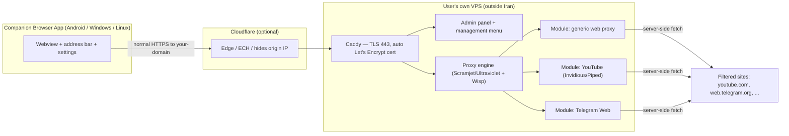

# Bumshi (بامشی) — Self-Hosted, Censorship-Resistant Web Proxy & Browser

> **Project name: Bumshi (بامشی).** Deployed on your own VPS, it fetches filtered sites server-side
> and serves them to a companion browser app over ordinary HTTPS. (The workspace folder is still
> named `FastDown` from the original download-accelerator idea; the project has since pivoted and
> been renamed to **Bumshi**.)

---

## 1. Goal in one sentence

Let anyone deploy a small proxy on **their own VPS** with a single command, then use a companion
**browser app** to reach filtered websites (YouTube, Telegram, etc.) over **ordinary HTTPS** — no
VPN, no tunnel, nothing for DPI to fingerprint.

---

## 2. Why this approach (and why *not* a VPN/tunnel)

Iran's DPI blocks VPNs and tunnels (WireGuard, V2Ray/Xray, Shadowsocks, Trojan) because their
handshakes and traffic patterns are recognizable **as tunnels**. The censor detects the *protocol*,
not the content.

A **web proxy served as normal HTTPS** has no such signature. The client just makes a TLS
connection to a domain and loads a web page — indistinguishable from visiting any website, because
that is literally what it is doing. This gives us three things for free:

- **Encryption:** HTTPS already encrypts everything. DPI can never read the content of a TLS
  session. No custom crypto, no obfuscation layer needed.
- **Destination hiding:** the censored site (e.g. `youtube.com`) is fetched **server-side** by the
  VPS. The word "youtube" never appears on the wire; DPI only ever sees the connection to
  *your* domain.
- **Camouflage:** the traffic looks like web browsing because it *is* web browsing. There is no
  proxy-shaped pattern to detect, so no padding/mimicry (REALITY, uTLS, etc.) is required.

### Design decisions we explicitly rejected, and why

| Considered | Rejected because |
|---|---|
| VPN / tunnel (WireGuard, Xray, Trojan) | Fingerprintable → DPI blocks it. The problem we're avoiding. |
| Custom encrypted client↔server transport + random padding | Reinvents a tunnel. Random high-entropy traffic is *itself* a fingerprint (how Shadowsocks/obfs4 got detected). Unnecessary once we use plain HTTPS. |
| Server-side HTML rewriting only (Glype/PHProxy style) | Breaks on modern SPAs — dynamic JS builds URLs the server never sees. |
| Domestic (in-Iran) cache node in v1 | Only pays off for *shared/popular* files; adds complexity. Keep as a later optimization. |

---

## 3. The threat we actually design against

TLS hides content, so the censor is left with only these levers — and none of them is
protocol-based:

1. **SNI (the domain name)** is visible in the TLS handshake. If a specific domain becomes known,
   Iran can block **that one domain**.
2. **IP blocking** of a known VPS IP.
3. **Behavioral/volume** signals (weak, costly, false-positive-prone).

**Consequences that shape the whole product:**

- Blocking is **reactive and per-instance** — the censor must discover and block each domain/IP by
  hand. With thousands of people self-hosting unique domains, this is whack-a-mole that does not
  scale for them. **Decentralization is the resilience.**
- **Discovery, not detection, is the risk.** A domain gets found because it becomes *known* (a big
  public instance, a published instance list), not because DPI is clever. → Favor many small,
  private deployments; do **not** run a central public instance list.
- **Recovery is cheap.** A blocked instance = one dead domain/IP. Rotate domain/IP (or hide behind
  Cloudflare) and you're back. → Build one-command domain/IP rotation into the tooling.

### Mitigations (all optional, per-deployer choice)

- **Cloudflare in front:** shared SNI + hidden origin IP; shields origin from IP-blocking and active
  probing. Offered as an install prompt — each deployer decides.
- **ECH (Encrypted Client Hello):** encrypts the SNI entirely; the frontier against SNI blocking
  (Cloudflare-supported). Note the censor's counter is to block ECH/Cloudflare broadly.
- **Easy domain/IP rotation:** one command.

> **Honest edge cases, so we're not surprised:** the censor can also block the VPS **IP** (Cloudflare
> hides it); and during extreme clampdowns Iran sometimes throttles *all* foreign HTTPS, in which
> case everything foreign suffers, not just us. In normal operation the model holds cleanly.

---

## 4. Architecture overview



**Data flow:** the app loads `https://your-domain/` over ordinary HTTPS → Caddy terminates TLS →
the proxy engine (or a site-specific module) fetches the target **server-side** and streams it back.
DPI only ever sees TLS to `your-domain`.

---

## 5. Components

### 5.1 Server (the VPS side)

- **Front / TLS:** **Caddy** — automatic Let's Encrypt certificates, HTTP/2 & HTTP/3, reverse-proxy
  to the internal services. (nginx is an alternative but needs manual cert wiring.)
- **Proxy engine (reuse, don't reinvent):** **Scramjet** (or its predecessor **Ultraviolet**) from
  the TompHTTP project, with a **Wisp** transport server. These use a **service worker in the
  browser** to intercept *every* request the page makes — including dynamically built URLs, `fetch`
  /XHR, and WebSockets — and rewrite them through the proxy. This is what handles real SPAs instead
  of returning an empty shell.
- **Modules** (independent, pluggable — see §6).
- **Admin panel (server-side, deployer only):** small web UI (Vue/Svelte) for ongoing config —
  enable/disable modules, rotate domain, view status, manage users/access credentials. Accessed by
  the **deployer** in a normal browser, ideally on a **separate port behind a secret path** (not
  exposed on the public proxy domain). **Not part of the client app.** (Mirrors 3x-ui's Vue panel.)
- **Management menu:** a shell script (`bumshi.sh`, à la `x-ui.sh`) for start/stop/restart/update
  /reset-password/rotate-domain.

**Stack:** Go for the control service + panel backend (single static binary, easy to ship);
Node for the Scramjet/Wisp engine; Shell for install/management; Docker for the packaged path.

### 5.2 Client (the companion browser) — end users only

A thin **browser = webview pointed at the VPS proxy over normal HTTPS**, with minimal chrome
(URL/address bar, connection screen, settings). **It is strictly an end-user app and contains no
admin functions.** All server administration lives in the server-side admin panel (§5.1), used by
the deployer in a normal browser — never in this app. Do not conflate the two. Client traffic is
plain HTTPS to your domain: **no custom protocol, no client-side crypto, no padding.**

Cross-platform options (Android / Windows / Linux):

- **Tauri v2** (Rust core + system webview) — one codebase for desktop *and* mobile. Recommended;
  validate Linux (WebKitGTK) and Android webview behavior early.
- **Flutter + webview** — solid on mobile, less mature webview on desktop.
- **Per-platform native webview** (WebView2 on Windows, WebKitGTK on Linux, Android WebView) — most
  robust, most code.

Client settings are limited to: connection management (§5.3) and the optional fingerprint toggles
(§8.3). Nothing else.

### 5.3 End-user onboarding (client app)

The end user needs **access credentials** (distinct from the deployer's admin login) and the
instance **domain**. Support **all three** entry methods — no single one is mandatory:

1. **Connection link** — a single link (e.g. `bumshi://…`) bundling domain + access credentials;
   tap to configure.
2. **QR code** — the same connection link rendered as a QR; scan it (ideal on mobile).
3. **Manual** — type the domain and access username/password (always available as a fallback).

Rules and UX:

- **Domain, not a bare IP** — required for a valid Let's Encrypt TLS cert and the "looks like a normal
  website" property. Bare IP is allowed only as an advanced/local fallback.
- **Access auth ≠ admin auth** — the app only ever uses access credentials; the admin panel is
  server-side and out of scope for the app.
- **Enter once** — credentials are stored in the **OS keychain**; the app auto-reconnects on every
  later launch.
- After connecting, the user just **browses** — filtered sites are reached transparently.

---

## 6. Modules (both generic and per-site, kept separate)

Each module lives under `modules/` and can be enabled/disabled independently at install or in the
panel.

### 6.1 Generic web proxy — `server/internal/proxy` + `server/internal/webengine`
Implemented as a **custom Go engine** rather than reusing a Node engine (Scramjet/Ultraviolet +
Wisp), because a Go core gives us SSRF protection, streaming, one static binary, and shared
observability — a stronger, safer base (see the implementation for details). Two layers:

- **Server core** (`internal/proxy`): SSRF-safe streaming HTTP forwarder, transparent WebSocket
  tunnel, and best-effort server-side HTML/CSS URL rewriting.
- **Browser runtime** (`internal/webengine`): an embedded service worker + in-page hooks (fetch,
  XHR, WebSocket, DOM attributes) that route dynamic requests through `/p/`, served under
  `/__bumshi__/` and injected into proxied HTML.

Heavy SPAs (YouTube, Telegram) still get dedicated modules for reliability.

### 6.2 YouTube — `modules/youtube`
Generic proxies choke on YouTube (anti-bot, DASH video, aggressive JS). Ship a dedicated
**Invidious** or **Piped** instance instead — purpose-built front-ends that proxy the API *and*
video through the server.

- **Bandwidth reality:** video bytes still cross the international link → on slow connections add
  **server-side transcoding/downscaling** (`yt-dlp` + `ffmpeg`) to cut bitrate so it actually plays.
- **Caching bonus:** YouTube content is *shared*, so a domestic cache node (later) pays off here even
  though it doesn't for unique files.

### 6.3 Telegram — `modules/telegram`
See §7 for the full feasibility analysis. In short: proxy **Telegram Web** (`web.telegram.org`);
the engine **must** carry WebSocket (Wisp does). Treat like YouTube — its own tested module, not
blind reliance on the generic proxy.

---

## 7. Can the end user log into Telegram and use it? — **Yes, with caveats**

**Short answer: yes.** Telegram Web (`webk`/`webz` at `web.telegram.org`) is a normal web app that
runs in a browser over HTTPS + **WebSocket (wss)**. Loaded through a WebSocket-capable proxy engine
(Scramjet/Ultraviolet + Wisp), the user can log in and use it.

**How login works through the proxy:**
- The login page loads through the VPS; the phone-number + code flow runs like any web login.
- The **code arrives out-of-band** (SMS, or the Telegram app on another device) — the proxy doesn't
  affect delivery.
- Telegram sees the **VPS IP**, not the user's, so connectivity is fine.

**Caveats to test early (don't assume — verify end-to-end):**
- **WebSocket support is mandatory.** Telegram Web's live connection to its data centers is `wss`;
  the proxy engine must carry it (Wisp does). This is the #1 thing to validate.
- **Heavy, stateful SPA.** Like YouTube, Telegram Web is one of the harder targets (service worker,
  IndexedDB, per-DC connections). Expect friction; give it a dedicated, tested module.
- **Datacenter-IP logins** may trigger extra Telegram anti-abuse verification. Usually passes.
- **No voice/video calls.** WebRTC/UDP won't traverse a content proxy. Text, media, and channels
  work; calls don't.

**Verdict:** feasible and worth supporting as its own module. Prove WebSocket + full login flow in a
spike before committing UI polish.

---

## 8. Transport, security & the two "identical"s

**Client ↔ VPS transport:** plain **HTTPS/TLS 1.3** on 443. Nothing custom — no obfuscation,
padding, or extra crypto (they'd add a detectable signature without improving on TLS). **What DPI
sees:** TLS to `your-domain`, not the target site, not the content. **Only real leak:** SNI/domain +
IP, handled by decentralization + rotation + optional Cloudflare/ECH (§3).

There are **two different meanings of "identical,"** and confusing them is the main trap:

### 8.1 Identical to normal HTTPS — for the censor (already done, automatically)
DPI sees only encrypted TLS to your domain. It cannot see cookies, timezone, user-agent, or
WebSocket frames — all of it is inside HTTPS. **Nothing about the browser's identity matters for DPI
evasion.** No work required.

### 8.2 Functionality — things the proxy must carry or sites break (engine-level, once)
Handled **generically by the proxy engine (Scramjet/Ultraviolet + Wisp), enabled once**, working for
every site automatically — never added per-site by hand. The webview client already speaks all of
these natively, so there is almost no client code:

- **WebSocket (wss)** — live connections (Telegram, chat, notifications).
- **Cookies** — rewritten to the proxy domain so logins/sessions persist.
- **Redirects, CORS, referer/origin, `fetch`/XHR, service workers, streaming/range requests,
  blob/data URLs.**
- **Per-user session isolation** when an instance is shared (à la Rammerhead); a non-issue for
  single-user instances.

This long tail is exactly why we **reuse** the engine instead of reinventing it.

### 8.3 Fingerprint — what the *target site* sees (optional, user-toggle)
Timezone, user-agent, language, canvas, WebGL, screen size. The censor never sees these, so they are
**optional** — a privacy/anti-bot setting, not a requirement:

- **Default:** use the device's real values (simplest; most sites just work).
- **Optional toggle:** *"match the exit server"* — spoof timezone/language to the VPS location so IP
  and timezone don't contradict each other for strict anti-bot systems.

Toggles live in the app/panel settings. They exist to look clean to the *website*, never to the
censor.

### 8.4 Privacy & trust model (who can see the data)

A web proxy is a **man-in-the-middle by design**: the server terminates TLS and rewrites content, so
it necessarily handles plaintext — URLs, page content, form data, passwords, cookies. This **cannot
be hidden from the machine's root/admin**: root can read process memory (`/proc/<pid>/mem`, ptrace,
core dumps) and swap, so "in memory only" is **not** safe from root. Hardware TEEs (AMD SEV-SNP /
Intel TDX) are the only real defense against the host operator, but they need special hardware, break
the "any cheap VPS" goal, and are **out of scope**.

**Consequence — not for public/untrusted use.** Because the operator can see traffic, Bumshi is for
**self-hosting or trusted friends only**, never an open public service. This must be stated plainly
to users: only use an instance you run or trust, and don't log into sensitive accounts through
someone else's instance.

**Privacy requirements (RAM-only):**

- **No persistence** — process user content in memory and discard; never write it to disk or cache.
- **No logging of user traffic** — no URLs, request bodies, or credentials in logs.
- **Defense-in-depth hardening** (raises the bar; does *not* defeat root): run non-root, seccomp,
  drop capabilities, `kernel.yama.ptrace_scope`, disable core dumps, `mlock` (no swap) / encrypted
  swap, full-disk encryption.

**Development exception (deliberate):** debug logging **stays on during development** — needed to
build and debug the app. The no-log / no-persistence guarantees are enforced as the **final
hardening step before public release** (Step 7), not from day one.

---

## 9. Deployment

### 9.1 One-line install — offer both `curl` and `wget`

```bash
# curl
bash <(curl -Ls https://raw.githubusercontent.com/<you>/bumshi/main/install.sh)

# wget (for boxes without curl)
bash <(wget -qO- https://raw.githubusercontent.com/<you>/bumshi/main/install.sh)
```

### 9.2 Interactive prompts (decide once, at install)

The installer asks — with sensible defaults, so pressing Enter through it works:

1. **Domain** (e.g. `proxy.example.com`) — required for the TLS cert.
2. **Email** for Let's Encrypt.
3. **Modules to enable:** generic proxy / YouTube / Telegram (multi-select).
4. **Cloudflare?** `[y/N]` — if yes, guidance/hooks to front the origin.
5. **Admin username + password** (or auto-generate and print).
6. **Panel port** (default randomized).

### 9.3 Docker Compose (recommended alternative to `curl | bash`)

Ship a `docker-compose.yml` bundling **Caddy + engine + enabled modules + panel**. Pins versions,
easy updates, and reassures users who distrust piping a script into a shell.

```bash
git clone https://github.com/<you>/bumshi && cd bumshi
cp .env.example .env   # edit domain, email, modules, admin creds
docker compose up -d
```

### 9.4 systemd + management menu

- `systemd` service files (debian/rhel/arch) so it survives reboots.
- `bumshi.sh` management menu: `start | stop | restart | status | update | reset-password |
  rotate-domain | logs`.

### 9.5 After install

Prints the **panel URL + login credentials** → user pastes them into the companion browser app.

---

## 10. Repository layout (monorepo)

Actual layout as implemented so far (planned items marked):

```
bumshi/
├── docker-compose.yml         # dev stack (Caddy + bumshid)
├── Caddyfile                  # edge / TLS config
├── Makefile                   # developer tasks
├── .env.example
├── .github/workflows/ci.yml   # build, test, lint, govulncheck, node, docker
├── DESIGN.md                  # this file
├── README.md
├── server/                    # Go module (github.com/bumshi/bumshi/server)
│   ├── cmd/bumshid/           # control-plane entrypoint
│   ├── internal/
│   │   ├── config/ logging/ version/ metrics/ health/ httpx/ server/
│   │   ├── proxy/             # web proxy engine core
│   │   │   ├── ssrfguard/ fetch/ link/ rewrite/  (+ proxy.go, websocket.go)
│   │   └── webengine/         # browser runtime: serve + inject
│   │       └── assets/        # codec.js, rewriter.js, sw.js, client.js (embedded)
│   └── Dockerfile
├── install.sh                 # (planned) one-liner installer (curl & wget)
├── bumshi.sh                  # (planned) management menu
├── modules/youtube, telegram  # (planned) per-site modules
├── app/                       # (planned) companion browser (Tauri v2)
└── deploy/                    # (planned) systemd units, cloudflare helpers
```

---

## 11. Implementation order (production-grade)

> **Principle:** foundations before features; **one working vertical slice before breadth**;
> security, tests, and CI from day one — never bolted on later. Nothing merges without CI green.

**Step 0 — Project foundations.**
Monorepo scaffold; GPL-3.0 license; `README` / `CONTRIBUTING` / `CODEOWNERS`; formatters + linters +
pre-commit hooks; **CI on every PR** (build, unit tests, lint, dependency + container scanning);
reproducible builds; a `docker-compose` dev environment; secrets kept out of the repo
(`.env.example` only); Dependabot/Renovate for updates.

**Step 1 — Server skeleton + TLS.**
Caddy front with automatic Let's Encrypt (HTTPS to a hello page). Go control service with typed
config, structured logging, `/healthz` + `/readyz`, Prometheus metrics, graceful shutdown, and panic
recovery. Hardened TLS config + security headers.

**Step 2 — Generic proxy engine (the vertical slice).**
Integrate Scramjet/Ultraviolet + Wisp behind Caddy. Wire the functional must-carry list (§8.2):
WebSocket, cookies, redirects, CORS, streaming, session isolation. **Exit criterion:** reach a real
filtered site end-to-end, covered by automated smoke/E2E tests against a fixed site set.

**Step 3 — Auth, admin panel, management.**
Secure admin auth (Argon2 password hashing, secure sessions, CSRF, rate limiting, lockout). Panel
(Vue/Svelte): module enable/disable, status, users, domain rotation. Management CLI (`bumshi.sh`)
+ systemd units (debian/rhel/arch).

**Step 4 — Production installer & packaging.**
`install.sh` (curl **and** wget), `set -euo pipefail`, idempotent and re-runnable, checksum-verified
downloads, clear prompts with safe defaults. Docker Compose path with **pinned, multi-arch images**.
Domain/IP rotation command. Cloudflare/ECH opt-in. **Release automation:** semver tags, signed
artifacts, changelog, tested upgrade **and rollback** path, config/state backup.

**Step 5 — Companion browser app.**
Tauri v2 scaffold, **Windows first** (Tauri v2 + WebView2 — the most robust webview). Webview →
instance; connect flow supporting **all three methods — manual / link / QR (§5.3)** — with **secure
credential storage** (OS keychain). End-user app only, **no admin functions**. Settings: fingerprint
toggles (§8.3). Automated build + **code signing**. Then expand to Android, then Linux.

**Step 6 — Site modules.**
YouTube: Invidious/Piped, then optional `yt-dlp` + `ffmpeg` transcoding; E2E-test video playback.
Telegram: **first a throwaway spike proving WebSocket + full login (§7)**, then productionize the
module with tests. Each module independently toggleable and independently tested.

**Step 7 — Privacy hardening & launch.**
**Enforce the privacy model before publishing (§8.4):** strip/disable the debug logging used during
development, guarantee **RAM-only / no-persistence / no-logs**, and verify nothing sensitive is
written to disk or swap. Then: threat-model review + panel pen-test; abuse controls; complete
self-host docs; **private beta** with small instances (no central instance list, no telemetry);
iterate; tag `v1.0`.

**Cross-cutting, at every step:** automated tests written alongside the code (unit + E2E), CI kept
green, security scanning on dependencies + containers, versioned releases, structured logs +
metrics, and docs updated in the *same* PR as the change.

---

## 12. Limitations & honest caveats

- **Not magically unblockable.** Resilience comes from *decentralization + rotation*, not from being
  invisible. A known domain/IP can be blocked; you recover by rotating.
- **Video bandwidth** still crosses the international link — transcoding helps, it isn't free speed.
- **WebRTC (calls) won't work** through a content proxy.
- **Heavy SPAs (YouTube, Telegram)** need dedicated modules and testing; the generic proxy alone is
  best-effort.
- **Extreme clampdowns** (broad foreign-HTTPS throttling) affect everything, not just us.
- **`curl | bash`** convenience vs. trust — always offer the Docker/pinned path too.

---

## 13. Positioning

Personal-use, access-to-information tooling — same framing as comparable open-source panels
("for personal usage; not for illegal purposes"). Ship a clear license (GPL-3.0 is the norm for this
category) and a plain statement of intent.

---

## 14. Decisions

**Settled:**

- **Project name:** Bumshi (بامشی).
- **First platform (client app):** Windows (Tauri v2 + WebView2 — the most robust webview); then
  Android, then Linux.
- **Client framework:** Tauri v2.
- **Privacy model:** RAM-only, no persistence, no logs — debug logging kept during development, the
  no-log/no-persistence guarantees enforced as the final step before public release (§8.4).
- **Not public/untrusted:** the operator can see plaintext, so instances are for self-host or
  trusted friends only. TEE/confidential-computing is out of scope.

**Still open (non-blocking):**

- **Telegram** now, or as its own later step (Step 6)?
- **Server language split:** Go control service + Node proxy engine (proposed) — keep or consolidate?
```
